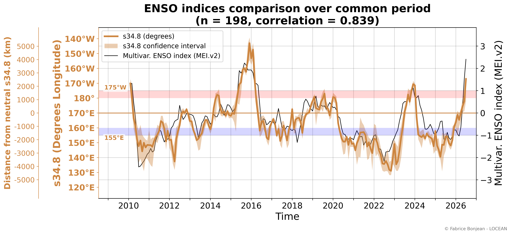
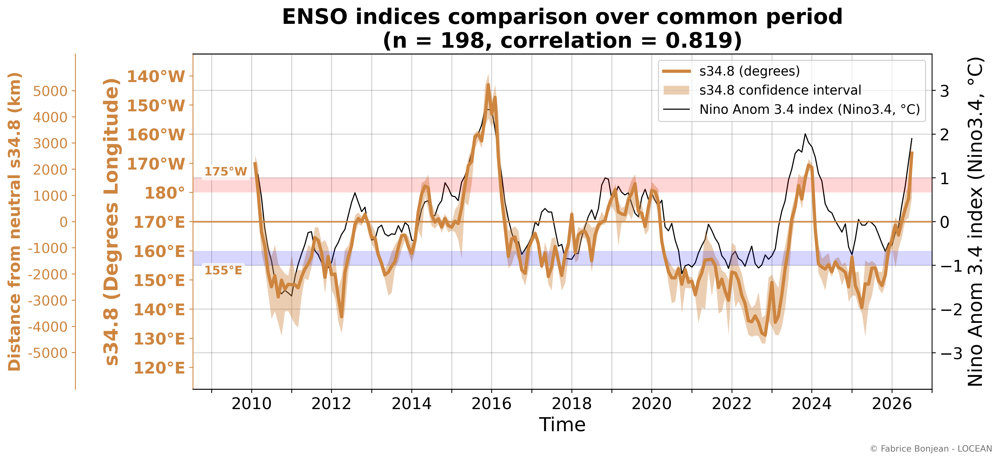
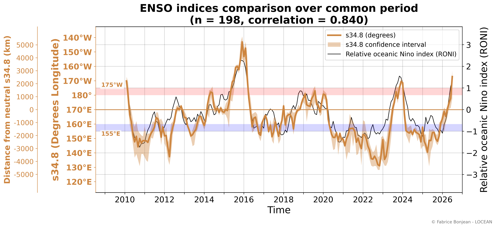
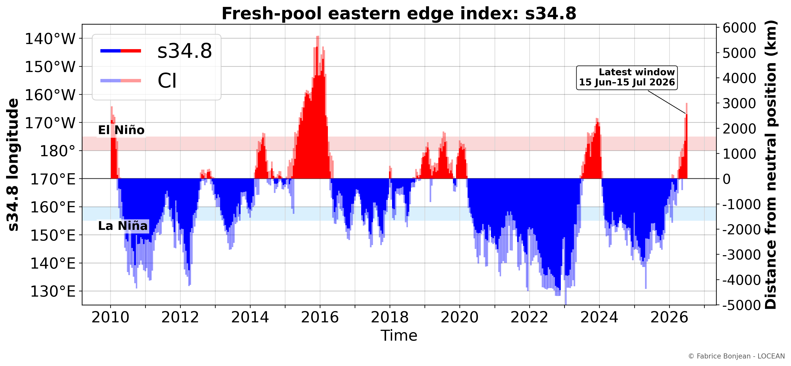
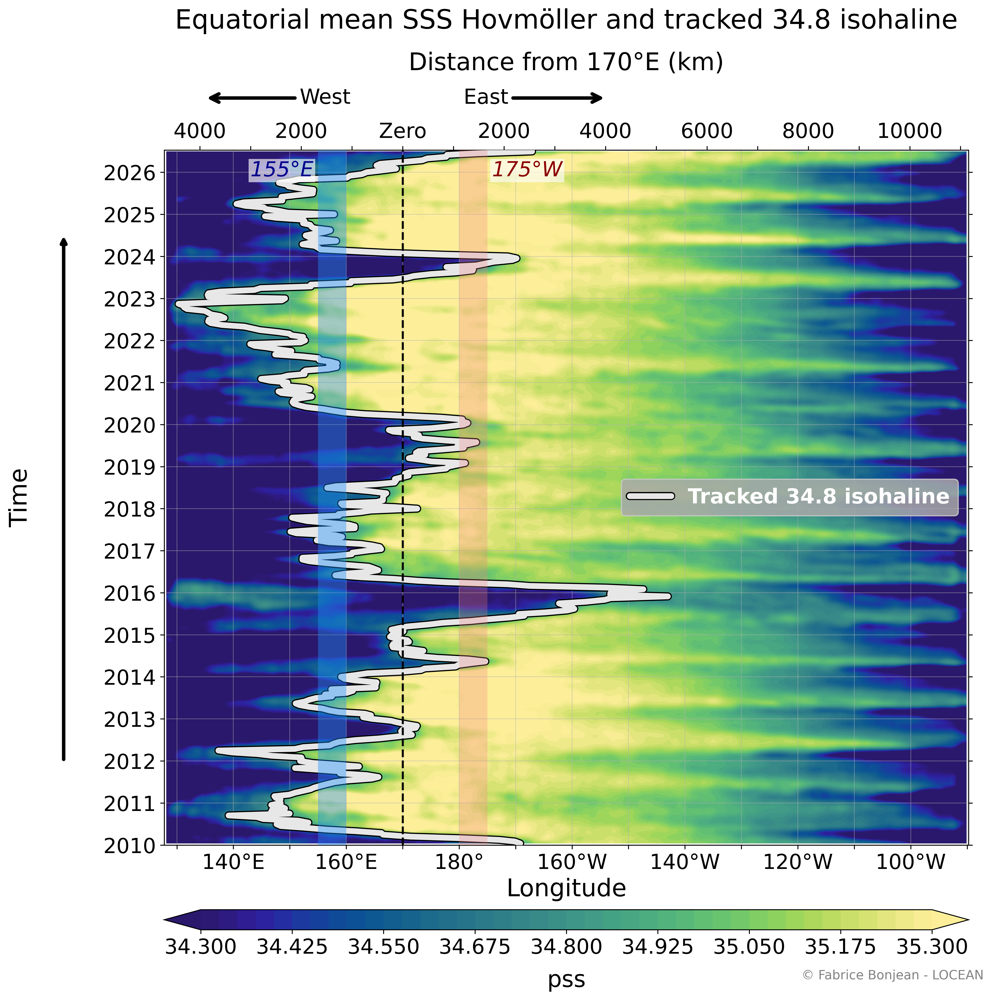
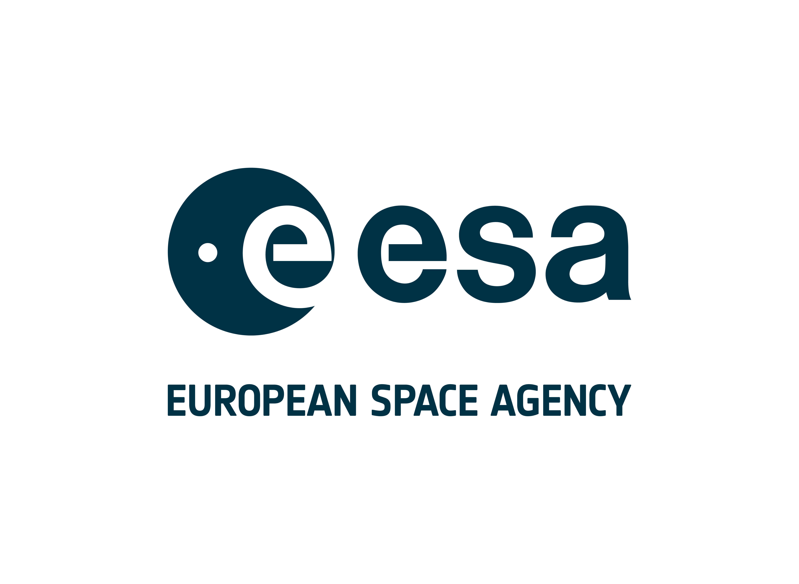
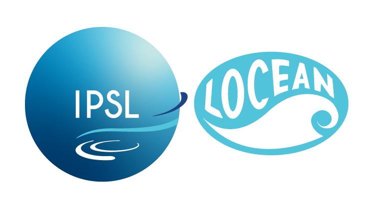
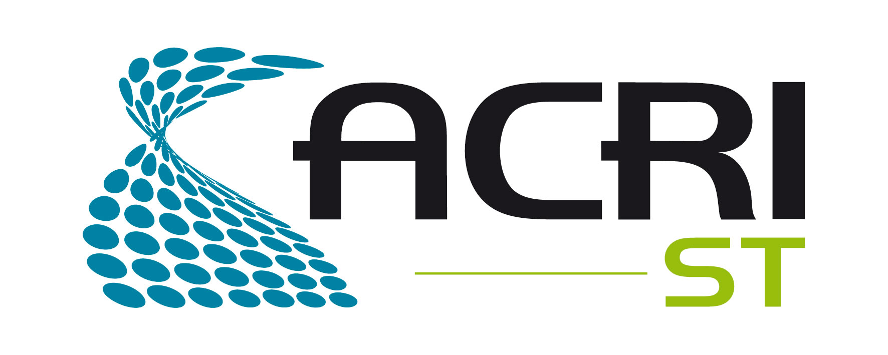

::: {.hero-map}
::: {.hero-text}
## Watching ENSO Through Sea Surface Salinity

### A satellite salinity view of the developing 2026 El Niño

The displacement of the western Pacific fresh-pool edge provides an independent SSS-based view of El Niño/La Niña evolution.
:::
:::

::: {.status-box}
**Status of this page**  
This page is a scientific demonstrator. It shows how satellite sea surface salinity (SSS) can help monitor El Niño–Southern Oscillation (ENSO) from an independent ocean-salinity perspective.
:::

::: {.latest-box}
**Latest situation**  
The SSS-based indicator now shows a marked eastward displacement of the equatorial western Pacific fresh-pool edge. The 34.8-pss fresh-pool edge has clearly crossed the El Niño longitude threshold and has moved farther east than the maximum reached during the 2024 El Niño. This indicates El Niño conditions from the salinity perspective.

This salinity-based evolution is consistent with the latest seasonal forecasts of the Copernicus Climate Change Service (C3S), which indicate that further strengthening of El Niño conditions is very likely.

::: {.latest-meta}
**Latest SSS data:**  
**Page update:** 
:::
:::

# Dashboard: recent evolution

The dashboard below focuses on the most recent three years, ending with the latest available SSS field. The upper panel shows sea surface salinity in the tropical Pacific, with the 34.8-pss isohaline marking the eastern edge of the western equatorial fresh pool. The red circle/ellipse highlights the tracked fresh-pool edge between 2°S and 2°N. The lower panel shows the synchronized evolution of the SSS-based ENSO indicator.

<video class="dashboard-video" controls preload="none" poster="assets/figures/latest/dashboard_sss_enso_poster_latest.png">
  <source src="assets/animations/dashboard_sss_enso_latest.mp4" type="video/mp4">
  Your browser does not support the video tag.
</video>

# Key message

During El Niño development, the western Pacific fresh pool tends to expand eastward. Satellite sea surface salinity observations allow this displacement to be monitored month by month. The longitude of the 34.8-pss isohaline provides a simple way to track this movement and compare it with reference ENSO indicators.

# Retrospective view: 2010 to present

The animation below provides the full retrospective view since the beginning of the salinity-satellite period used here. It combines three synchronized diagnostics:

- the map animation of sea surface salinity and the tracked 34.8-pss isohaline;
- the Hovmöller diagram showing the longitude-time evolution of equatorial SSS;
- the SSS-based ENSO indicator evolving through time.

This combined view shows how the current evolution compares with previous El Niño and La Niña episodes.

<video class="highlight-video" controls preload="none" poster="assets/figures/latest/combined_sss_enso_poster_latest.png">
  <source src="assets/animations/combined_sss_enso_latest.mp4" type="video/mp4">
  Your browser does not support the video tag.
</video>

# Comparison with established ENSO indicators

The salinity-based indicator is compared below with widely used ENSO indicators. The agreement between them supports the interpretation that the displacement of the salinity front captures the ENSO signal from an independent salinity perspective. Differences are also informative, because sea surface salinity reflects freshwater fluxes, ocean transport, and coupled ocean-atmosphere processes in a way that differs from indices based on sea surface temperature (SST) or multivariate ENSO indices.

## MEI.v2

MEI.v2 is a multivariate ENSO index combining oceanic and atmospheric information. It provides a broad reference for coupled ENSO variability.

{fig-alt="Comparison between the SSS-based ENSO indicator and MEI.v2."}

## Niño 3.4

Niño 3.4 is a classical SST-based ENSO index in the central-eastern equatorial Pacific.

{fig-alt="Comparison between the SSS-based ENSO indicator and Niño 3.4."}

## RONI

RONI is a relative Niño 3.4 index designed to account for the broader tropical warming background.

{fig-alt="Comparison between the SSS-based ENSO indicator and RONI."}

# Additional diagnostics

The static figures below provide complementary views of the same SSS-based indicator. They are useful for readers who want to inspect the full-period record without replaying the animations.

## Full-period SSS-based ENSO indicator

{fig-alt="Latest SSS-based ENSO indicator derived from the longitude of the 34.8 pss isohaline in the equatorial Pacific."}

## Full-period Hovmöller view

{fig-alt="Hovmöller diagram showing equatorial sea surface salinity as a function of longitude and time with the tracked 34.8 pss isohaline."}

# Interpretation and caveats

This SSS indicator is experimental. Like all climate indices, it depends on methodological choices and on the product version used. In particular, it is sensitive to the definition of the isohaline, the latitude band, the selected longitude domain, the treatment of uncertain satellite retrievals, the handling of near-real-time data, and the definition of thresholds.

It should be interpreted as a complementary observational indicator, not as an operational ENSO product. The analysis is work in progress.

# Related ESA story

A general-audience ESA web story presents the broader context of SMOS sea surface salinity observations during El Niño development. This demonstrator builds on the same scientific motivation, with additional diagnostics focused on the equatorial western Pacific fresh-pool edge.

[SMOS salinity could offer early indicator of El Niño](https://www.esa.int/Applications/Observing_the_Earth/FutureEO/SMOS/SMOS_salinity_could_offer_early_indicator_of_El_Nino)

# References

- Qu, T., & Yu, J.-Y. (2014). *ENSO indices from sea surface salinity observed by Aquarius and Argo*. Journal of Oceanography, 70, 367–375. DOI: 10.1007/s10872-014-0238-4.
- MEI.v2: NOAA Physical Sciences Laboratory, <https://psl.noaa.gov/data/timeseries/month/DS/MEIV2/>
- Niño 3.4: NOAA Physical Sciences Laboratory / NOAA Climate Prediction Center, <https://psl.noaa.gov/data/timeseries/month/DS/Nino34_CPC/>
- RONI: NOAA Physical Sciences Laboratory, <https://psl.noaa.gov/data/timeseries/month/DS/RONI/>
- CCI+SSS: ESA Climate Change Initiative Sea Surface Salinity project.
- C3S: Copernicus Climate Change Service.
- C3S seasonal forecasts, <https://climate.copernicus.eu/seasonal-forecasts>

# Credits

**Scientific lead:** Fabrice Bonjean — LOCEAN

**Scientific and technical contributors**

- Jacqueline Boutin — LOCEAN
- Roberto Sabia — ESA
- Frédéric Rouffi — ACRI-ST
- Sebastien Guimbard — OCEANOSCOPE
- Jean-Luc Vergely — ACRI-ST
- Laetitia Parc — ACRI-ST
- Nicolas Kolodziejczyk — LOPS

::: {.logo-row}

:::

::: {.c3s-logo-row}

:::
